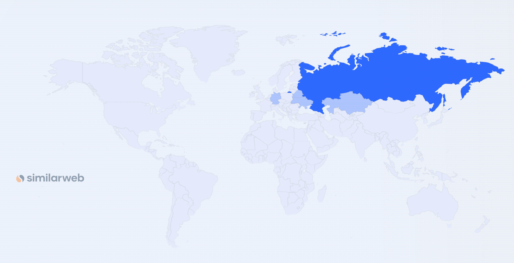
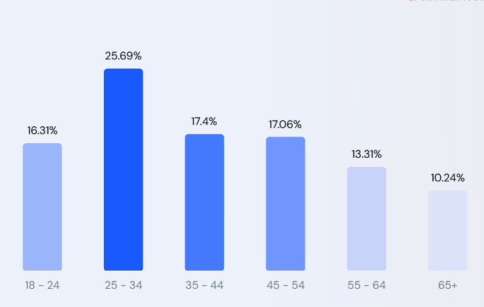

# highload-ozon

## Расчетно-пояснительная записка

по курсовой работе на тему 
«Проектирование высоконагруженных систем»

**Студент:** Куренков Дмитрий  
**Группа:** WEB-31  
**Курс:** Технопарк (VK и МГТУ им. Н.Э. Баумана)

В рамках данной работы рассматривается проектирование архитектуры интернет-магазина, подобного Ozon, с учётом высоких нагрузок, масштабируемости и обеспечения отказоустойчивости системы.

Целевая аудитория включает:
- **Покупателей:** конечные пользователи, для которых важны удобство поиска, детальная информация о товарах, прозрачный процесс оформления заказа и оперативная доставка.
- **Продавцов:** компании и индивидуальные предприниматели, желающие продавать товары через онлайн-платформу.
- **Технические специалисты:** разработчики и системные администраторы, ответственные за поддержание высоконагруженной инфраструктуры.

---

## Содержание

1. [Тема и целевая аудитория](#тема-и-целевая-аудитория)
2. [Расчет нагрузки](#расчет-нагрузки)
3. [Глобальная балансировка нагрузки](#глобальная-балансировка-нагрузки)
4. [Локальная балансировка нагрузки](#локальная-балансировка-нагрузки)
5. [Логическая схема БД](#логическая-схема-бд)
6. [Физическая схема БД](#физическая-схема-бд)
7. [Алгоритмы](#алгоритмы)
8. [Технологии](#технологии)
9. [Обеспечение надёжности](#обеспечение-надёжности)
10. [Схема проекта](#схема-проекта)
11. [Список серверов](#список-серверов)
12. [Список источников](#список-источников)

---

## 1. Тема и целевая аудитория 

### Тема:

Ozon – один из ведущих российских маркетплейсов, основанный в 1998 году как интернет-магазин книг и видеокассет. Сегодня платформа предлагает широкий ассортимент товаров — от одежды и электроники до товаров для дома — и развивает дополнительные сервисы, такие как:

- **Ozon Fresh:** экспресс-доставка товаров повседневного спроса.
- **Ozon Банк:** финансовые сервисы для покупателей и продавцов.
- **Ozon Travel:** бронирование авиа- и железнодорожных билетов, отелей и туров.

Ozon использует собственную логистическую инфраструктуру и сотрудничает с тысячами продавцов, что позволяет обслуживать десятки миллионов покупателей как в России, так и в ряде зарубежных стран.

В условиях курсовой работы будет взята небольшая часть продукта (mvp), которую рассмотрим ниже.

### Функциональные требования (MVP):

Для реализации минимально жизнеспособного продукта (MVP) интернет-магазина целесообразно включить следующие функции:

1. **Каталог товаров**
    - Возможность просмотра товаров.

2. **Поиск товаров**
    - Функционал поиска по ключевым словам.

3. **Страница товара**
    - Подробное описание товара, включая цену, характеристики и отзывы.

4. **Корзина**
    - Добавление, удаление и изменение количества товаров, а также указание адреса доставки.

5. **Оформление заказа**
    - Выбор способа оплаты и доставки, подтверждение заказа.

6. **Отслеживание состояния заказа (трэкинг)**
    - Интеграция с логистическими сервисами для мониторинга статуса доставки.

7. **Авторизация/регистрация**
    - Личный кабинет для просмотра истории заказов и управления персональными данными.

8. **Выставление товара на продажу (для продавцов)**
    - Функционал размещения товаров на платформе (опционально для расширения MVP).

> **Комментарий:**  
> Данный набор функций охватывает основные сценарии использования интернет-магазина. Для MVP достаточно реализовать ключевые функции, связанные с составлением, оформлением и отслеживанием заказа. Если планируется дальнейшее развитие платформы, можно дополнительно включить личный кабинет для продавцов и расширенную интеграцию с логистическими системами.

---

### Целевая аудитория и анализ веб-трафика

**Целевая аудитория Ozon:**

- **Покупатели:** пользователи, ценящие удобство онлайн-шопинга, широкий ассортимент и оперативную доставку.
- **Продавцы:** компании, желающие расширить свои каналы сбыта через маркетплейс.
- **Технические специалисты:** разработчики и системные администраторы, ответственные за поддержание высоконагруженной инфраструктуры.

**Анализ веб-трафика (для января 2025-ого):**

- **Общее количество визитов:** 436.7 млн
- **Изменение за последний месяц:** -5.96%
- **Количество активных покупателей (среднее за первую половину 2024-ого)** 51.1 миллион пользователей
- **Процент отказов:** 26.42%
- **Количество страниц за визит:** 11.16
- **Средняя продолжительность визита:** 00:08:58
- **Количество заказов (3-ий квартал 2024-ого):** 371,5 млн
- **Активные покупатели (3-ий квартал 2024-ого):** >53 млн
- **Активные продавцы (3-ий квартал 2024-ого):** >550 тыс

**Географическое распределение:**

- **Россия:** 95.46% (основной источник трафика, преимущественно с настольных компьютеров)
- Другие страны: Беларусь, Казахстан, Кыргызстан, Армения, Китай, Турция и т.д.

(данные по similarweb)
- **Россия:** 95.46%
- **Беларусь:** 0.6%
- **Германия:** 0.5%
- **Украина:** 0.49%
- **Казахстан:** 0.43%
- **Другие:** 2.53%

**Демографические показатели (за январь 2025-ого similarweb):**

- **Пол:** 61.85% мужчин и 38.15% женщин
- **Возраст:** наиболее многочисленная группа — 25–34 года

По данным retail за 2024 (исследование Tinkoff Data):

- **Пол продавцов:** 49% мужчин и 51% женщин

**Сравнительный анализ по предыдущим периодам:**
- **За 1 квартал 2024 года:** активные покупатели составляли около 49 млн, а частота заказов — 22 заказа в год.
- **За 3 квартал 2024 года:** зафиксирован рост активных покупателей до >53 млн и увеличение количества заказов до 371.5 млн.
- **Динамика:** эти данные демонстрируют устойчивый рост аудитории и увеличивающуюся вовлеченность пользователей за последние кварталы.

---

## 2. Расчет нагрузки 

---

## 3. Глобальная балансировка нагрузки 

---

## 4. Локальная балансировка нагрузки 

---

## 5. Логическая схема БД 

---

## 6. Физическая схема БД 

---

## 7. Алгоритмы 

---

## 8. Технологии 

---

## 9. Обеспечение надёжности 

---

## 10. Схема проекта 

---

## 11. Список серверов 

---

## 12. Список источников 

*Список литературы и источников, использованных при подготовке работы*

1. Анализ трафика Ozon по данным SimilarWeb: [https://www.similarweb.com/ru/website/ozon.ru/#overview](https://www.similarweb.com/ru/website/ozon.ru/#overview)
2. Корпоративный сайт Ozon – пресс-релизы и финансовые отчёты с ключевыми метриками, включая MAU. [https://corp.ozon.ru/#rec535834970](https://corp.ozon.ru/#rec535834970)
3. Финансовый отчет Ozon за шесть месяцев, закончившихся 30 июня 2024 года: [https://ir.ozon.com/upload/iblock/f16/fto4qrjes1bfzyljqrym7aplxm24zune/Ozon_Report%20for%20the%20six%20months%20ended%20June%2030,%202024.pdf](https://ir.ozon.com/upload/iblock/f16/fto4qrjes1bfzyljqrym7aplxm24zune/Ozon_Report%20for%20the%20six%20months%20ended%20June%2030,%202024.pdf)
4. Финансовые результаты Ozon за 3 квартал 2024 года (отчет): [https://ir.ozon.com/upload/iblock/ba3/typisczp1lag8kx9nwt7u8g7pf0hczbh/%D0%A0%D0%B5%D0%B7%D1%83%D0%BB%D1%8C%D1%82%D0%B0%D1%82%D1%8B%20Ozon%20%D0%B7%D0%B0%203%20%D0%BA%D0%B2%D0%B0%D1%80%D1%82%D0%B0%D0%BB%202024%20%D0%B3%D0%BE%D0%B4%D0%B0.pdf](https://ir.ozon.com/upload/iblock/ba3/typisczp1lag8kx9nwt7u8g7pf0hczbh/%D0%A0%D0%B5%D0%B7%D1%83%D0%BB%D1%8C%D1%82%D0%B0%D1%82%D1%8B%20Ozon%20%D0%B7%D0%B0%203%20%D0%BA%D0%B2%D0%B0%D1%80%D1%82%D0%B0%D0%BB%202024%20%D0%B3%D0%BE%D0%B4%D0%B0.pdf)
5. Альтернативный финансовый отчет Ozon за 3 квартал 2024 года: [https://ir.ozon.com/upload/iblock/a45/fwnv4ob83rvkjso8nrk77s7v7lx74klb/Ozon_%D0%A0%D0%B5%D0%B7%D1%83%D0%BB%D1%8C%D1%82%D0%B0%D1%82%D1%8B%20%D0%B7%D0%B0%203%20%D0%BA%D0%B2%D0%B0%D1%80%D1%82%D0%B0%D0%BB%202024%20%D0%B3%D0%BE%D0%B4%D0%B0.pdf](https://ir.ozon.com/upload/iblock/a45/fwnv4ob83rvkjso8nrk77s7v7lx74klb/Ozon_%D0%A0%D0%B5%D0%B7%D1%83%D0%BB%D1%8C%D1%82%D0%B0%D1%82%D1%8B%20%D0%B7%D0%B0%203%20%D0%BA%D0%B2%D0%B0%D1%80%D1%82%D0%B0%D0%BB%202024%20%D0%B3%D0%BE%D0%B4%D0%B0.pdf)
6. Анализ динамики продавцов на маркетплейсах в 2024 году (Retail.ru): [https://www.retail.ru/news/v-2024-godu-zhenshchin-sellerov-na-marketpleysakh-stalo-bolshe-chem-muzhchin-11-marta-2024-238458/](https://www.retail.ru/news/v-2024-godu-zhenshchin-sellerov-na-marketpleysakh-stalo-bolshe-chem-muzhchin-11-marta-2024-238458/)
7. Финансовые результаты Ozon за первый квартал 2024 года: [https://ir.ozon.com/upload/iblock/830/9tjbv92pmnd5nbmxne100ukbjftqctlv/Ozon%20%D0%BE%D0%B1%D1%8A%D1%8F%D0%B2%D0%BB%D1%8F%D0%B5%D1%82%20%D1%84%D0%B8%D0%BD%D0%B0%D0%BD%D1%81%D0%BE%D0%B2%D1%8B%D0%B5%20%D1%80%D0%B5%D0%B7%D1%83%D0%BB%D1%8C%D1%82%D0%B0%D1%82%D1%8B%20%D0%B7%D0%B0%20%D0%BF%D0%B5%D1%80%D0%B2%D1%8B%D0%B9%20%D0%BA%D0%B2%D0%B0%D1%80%D1%82%D0%B0%D0%BB%202024%20%D0%B3%D0%BE%D0%B4%D0%B0.pdf](https://ir.ozon.com/upload/iblock/830/9tjbv92pmnd5nbmxne100ukbjftqctlv/Ozon%20%D0%BE%D0%B1%D1%8A%D1%8F%D0%B2%D0%BB%D1%8F%D0%B5%D1%82%20%D1%84%D0%B8%D0%BD%D0%B0%D0%BD%D1%81%D0%BE%D0%B2%D1%8B%D0%B5%20%D1%80%D0%B5%D0%B7%D1%83%D0%BB%D1%8C%D1%82%D0%B0%D1%82%D1%8B%20%D0%B7%D0%B0%20%D0%BF%D0%B5%D1%80%D0%B2%D1%8B%D0%B9%20%D0%BA%D0%B2%D0%B0%D1%80%D1%82%D0%B0%D0%BB%202024%20%D0%B3%D0%BE%D0%B4%D0%B0.pdf)
