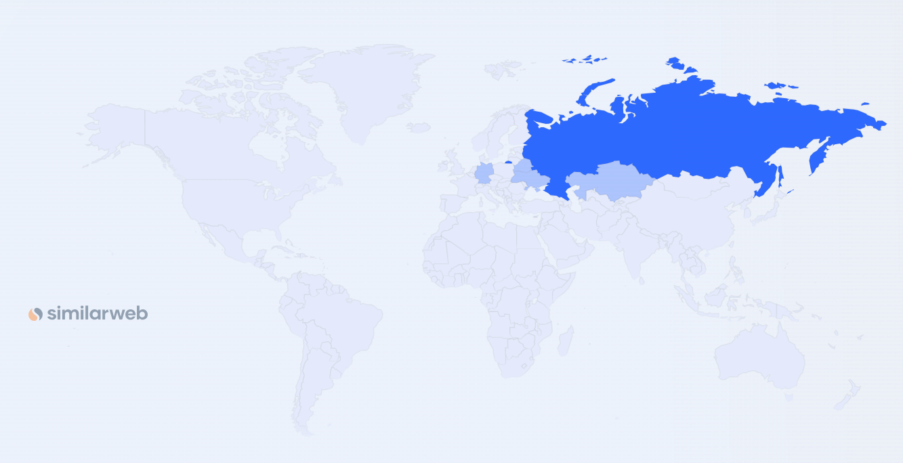
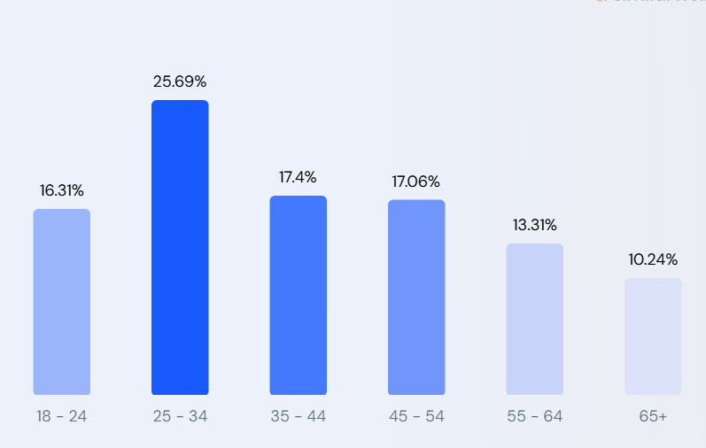
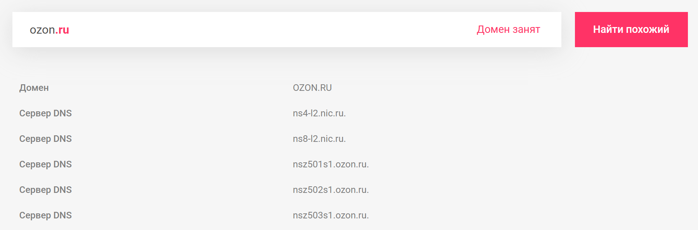

# highload-ozon

## Расчетно-пояснительная записка

по курсовой работе на тему 
«Проектирование высоконагруженных систем»

**Студент:** Куренков Дмитрий  
**Группа:** WEB-31  
**Курс:** Технопарк (VK и МГТУ им. Н.Э. Баумана)

В рамках данной работы рассматривается проектирование архитектуры интернет-магазина, подобного Ozon, с учётом высоких нагрузок, масштабируемости и обеспечения отказоустойчивости системы.

Целевая аудитория включает:
- **Покупателей:** конечные пользователи, для которых важны удобство поиска, детальная информация о товарах, прозрачный процесс оформления заказа и оперативная доставка.
- **Продавцов:** компании и индивидуальные предприниматели, желающие продавать товары через онлайн-платформу.
- **Технические специалисты:** разработчики и системные администраторы, ответственные за поддержание высоконагруженной инфраструктуры.

---

## Содержание

1. [Тема и целевая аудитория](#тема-и-целевая-аудитория)
2. [Расчет нагрузки](#расчет-нагрузки)
3. [Глобальная балансировка нагрузки](#глобальная-балансировка-нагрузки)
4. [Локальная балансировка нагрузки](#локальная-балансировка-нагрузки)
5. [Логическая схема БД](#логическая-схема-бд)
6. [Физическая схема БД](#физическая-схема-бд)
7. [Алгоритмы](#алгоритмы)
8. [Технологии](#технологии)
9. [Обеспечение надёжности](#обеспечение-надёжности)
10. [Схема проекта](#схема-проекта)
11. [Список серверов](#список-серверов)
12. [Список источников](#список-источников)

---

## 1. Тема и целевая аудитория 

### Тема:

Ozon – один из ведущих российских маркетплейсов, основанный в 1998 году как интернет-магазин книг и видеокассет. Сегодня платформа предлагает широкий ассортимент товаров — от одежды и электроники до товаров для дома — и развивает дополнительные сервисы, такие как:

- **Ozon Fresh:** экспресс-доставка товаров повседневного спроса.
- **Ozon Банк:** финансовые сервисы для покупателей и продавцов.
- **Ozon Travel:** бронирование авиа- и железнодорожных билетов, отелей и туров.

Ozon использует собственную логистическую инфраструктуру и сотрудничает с тысячами продавцов, что позволяет обслуживать десятки миллионов покупателей как в России, так и в ряде зарубежных стран. [^2]

В условиях курсовой работы будет взята небольшая часть продукта (mvp), которую рассмотрим ниже.

### Функциональные требования (MVP):

Для реализации минимально жизнеспособного продукта (MVP) интернет-магазина целесообразно включить следующие функции:

1. **Работа с товарами (просмотр, детализация, отзывы, поиск)**
   - Функционал поиска товаров.
   - Функционал фильтра товаров (корректирует ленту выводимых товаров (как сами товары, так и их порядок)). (по цене, по категориям, по популярности, по дате добавления, по весу)
   - Подробное описание товара, включая цену, характеристики, изображения и отзывы.
   - Категории товаров
   - Главная страница с товарами (связь с пунктом 2, вывод на основе рекомендательной системы)

2. **Рекомендательная система**
   - Динамическая лента товаров, подстраивающаяся под пользователей.

3. **Отзывы**
   - Добавление (по одному за каждую покупку), редактирование, удаление, просмотр

4. **Корзина**
    - Добавление, удаление и изменение количества товаров, а также указание адреса доставки.

5. **Оформление заказа (базовое)**
    - Выбор способа оплаты (можно оставить для начала 1, но заложить, что их несколько) и доставки (можно оставить для начала 1, но заложить, что их несколько), подтверждение заказа.

6. **Работа с заказами**
   - Просмотр истории, просмотр деталей (страница заказа), просмотр статуса (получен товар или нет).

7. **Пользователь (авторизация/регистрация, личный кабинет)**
    - Личный кабинет для просмотра истории заказов и управления персональными данными.

8. **Личный кабинет продавца**
    - Функционал размещения товаров на платформе (опционально для расширения MVP).
    - Управление ценами и другими данными по выставленным товарам и заказами

Фичи:

1. **Интеграция способов оплаты**
   - Подключение платежных систем (карты, электронные кошельки). 
   - Возможность оплаты при получении.

2. **Отслеживание заказа (трекинг)**
   - Интеграция с логистическими сервисами для мониторинга статуса доставки.

3. **Вам может понравиться**
   - На основе рекомендательной системы для товара - товары которые могут заинтересовать пользователя на странице просматриваемого товара.

> **Комментарий:**  
> Данный набор функций охватывает основные сценарии использования интернет-магазина. Для MVP достаточно реализовать ключевые функции, связанные с составлением, оформлением и отслеживанием заказа. Если планируется дальнейшее развитие платформы, можно дополнительно включить личный кабинет для продавцов и расширенную интеграцию с логистическими системами.

> **Комментарий:**  
> Стоит отметить, что необязательным для mvp, но очень рекомендуемым для пользовательского опыта была бы реализация загрузки материала (например карточек товара или отзывов) до того, как это понадобится пользователю, отметая время которое он бы ждал, когда ему захочется увидеть ещё товаров.

---

### Целевая аудитория и анализ веб-трафика

**Целевая аудитория Ozon:**

- **Покупатели:** пользователи, ценящие удобство онлайн-шопинга, широкий ассортимент и оперативную доставку.
- **Продавцы:** компании, желающие расширить свои каналы сбыта через маркетплейс.
- **Технические специалисты:** разработчики и системные администраторы, ответственные за поддержание высоконагруженной инфраструктуры.

**Анализ веб-трафика (для января 2025-ого):**

- **Общее количество визитов:** 436.7 млн [^1]
- **Изменение за последний месяц:** -5.96% [^1]
- **Количество активных покупателей (среднее за первую половину 2024-ого)** 51.1 миллион пользователей [^3]
- **Процент отказов:** 26.42% [^1]
- **Количество страниц за визит:** 11.16 [^1]
- **Средняя продолжительность визита:** 00:08:58 [^1]
- **Количество заказов (3-ий квартал 2024-ого):** 371,5 млн (подобные значения можно отследить и ранее) [^4], [^8]
- **Активные покупатели (3-ий квартал 2024-ого):** >53 млн (подобные значения можно отследить и ранее) [^4], [^5], [^8]
- **Активные продавцы (3-ий квартал 2024-ого):** >550 тыс [^5]

**Географическое распределение:** [^1]

- **Россия:** 95.46% (основной источник трафика, преимущественно с настольных компьютеров)
- Другие страны: Беларусь, Казахстан, Кыргызстан, Армения, Китай, Турция и т.д. [^8]

(данные по similarweb) [^1]
- **Россия:** 95.46%
- **Беларусь:** 0.6%
- **Германия:** 0.5%
- **Украина:** 0.49%
- **Казахстан:** 0.43%
- **Другие:** 2.53%

**Демографические показатели (за январь 2025-ого similarweb):** [^1]

- **Пол:** 61.85% мужчин и 38.15% женщин
- **Возраст:** наиболее многочисленная группа — 25–34 года

По данным retail за 2024 (исследование Tinkoff Data): [^6]

- **Пол продавцов:** 49% мужчин и 51% женщин

**Сравнительный анализ по предыдущим периодам:**
- **За 1 квартал 2024 года:** активные покупатели составляли около 49 млн, а частота заказов — 22 заказа в год. [^7]
- **За 3 квартал 2024 года:** зафиксирован рост активных покупателей до >53 млн и увеличение количества заказов до 371.5 млн. [^4], [^5]
- **Динамика:** эти данные демонстрируют устойчивый рост аудитории и увеличивающуюся вовлеченность пользователей за последние кварталы.

---

## 2. Расчет нагрузки 

**Данные по годам (2023 и 2024):**

Таблица 1 - данные по кварталам 2023 года

| Квартал 2023-ого             | Активные покупатели (млн) | Количество заказов (млн) | Активные продавцы (тыс)     | Частота заказов в год |
|------------------------------|---------------------------|--------------------------|-----------------------------|-----------------------|
| 1 [^15], [^16]               | ~37                       | ~179,3                   | x                           | ~15                   |
| 2 [^14]                      | ~39,5                     | ~209                     | x                           | ~17                   |
| 3 [^12], [^13]               | ~42                       | ~251                     | \>36 (пользователи Fintech) | ~19                   |
| 4 [^11], [^12], [^14], [^15] | ~46,1                     | ~326,7                   | x                           | ~21                   |

Таблица 2 - данные по кварталам 2024 года

| Квартал 2024-ого | Активные покупатели (млн) | Количество заказов (млн) | Активные продавцы (тыс) | Частота заказов в год |
|------------------|---------------------------|--------------------------|-------------------------|-----------------------|
| 1 [^10]          | ~49                       | ~305                     | ~500                    | ~22                   |
| 2 [^9]           | ~51,1                     | ~335                     | x                       | ~24                   |
| 3 [^5], [^4]     | ~53,5                     | ~371,5                   | \>550                   | ~25                   |
| 4                | x                         | x                        | x                       | x                     |

**На основе этих данных можно примерно оценить MAU и DAU, а также другие продуктовые метрики:**

*Квартал = 3-ем месяцам:*
- 1-ый квартал - январь, февраль, март, поэтому 31+28+31=90 дней (в 2024 - 91 день)
- 2-ой квартал - апрель, май, июнь, поэтому 30+31+30=91 дней
- 3-ий квартал - июль, август, сентябрь, поэтому 31+31+30=92 дня
- 4-ий квартал - октябрь, ноябрь, декабрь, поэтому 31+30+31=92 дня

Обозначим:
- Средний размер хранилища пользователя в штуках и гигабайтах (по типам, там где существенно) -- СРХП
- Среднее количество действий пользователя -- СКДП 

*Рассмотрим данные необходимые для примерной оценки этих значений, оценим MAU и DAU:*

Рассмотрим получение MAU 2-мя способами и сопоставим их получив более менее точное значение:
- Воспользуемся сервисом Pr-Cy [^17] для примерной оценки MAU, который более точен, чем его аналоги SimilarWeb и Be1.
- Возьмем WAU основываясь на данных со страницы продавцов [^18] по посетителям за последние 7 дней и рассчитаем относительно этих данных и данным из финансовых отчетов примерное значение MAU.

***Данные от Pr-Cy***

(Для пользователей, так что вычитаем отказы)

MAU ≈ 323.2M

Однако с учетом того, что не все эти пользователи - активные (совершают действие покупки), переоценим это через отношения за известные периоды времени

Тогда за 3-ий квартал 2024 примерно 304,12 млн. (410,97 за вычетом 26% отказов), а активных из них по таблице 2 - 53,5 млн., что есть  примерно 17,59%.
Для продавцов (по таблице 2 их 550 тыс.) это примерно 0,2%

Сделаем то же самое для 2-ого квартала:

Тогда за 2-ой квартал 2024 примерно 281,64 млн., а активных из них по таблице 2 - 51,1 млн., что есть 18,14%.
Для продавцов (по таблице 2 можем предположить, что их примерно 525 тыс.) это примерно 0,2%

Экстраполяция: активные пользователи (которые заказывают) ≈ 18% от общего числа, а продавцы и то всего 0,2%.

Тогда получаем, что MAU ≈ 58,176 млн.

***Данные по отчетам Ozon и математическим приблизительным расчетам***

По данным от 12.02.2025 18:07 WAU от сайта для продавцов: [^18]

WAU примем равным за 45276595, что примерно равно 45,28 млн.

Теперь проведем примерную оценку данных для четвертого квартала, основываясь на данных из таблиц 3 и 4.

*Активные покупатели (млн)*

- Тренд роста в 2023: линейный с ускорением в Q4 (+4.1 млн).
- В 2024 квартальный прирост: ~2.47 млн (среднее за 2024).
- Учет сезонности 2023: предполагаем дополнительный прирост +1.6 млн.

$$
Q4_{2024} = Q3_{2024} + \text{средний прирост} + \text{сезонная поправка} = 53.5 + 2.47 + 1.6 \approx 57.6 \text{ млн}
$$

Погрешность: ±2 млн (возможное замедление роста).

*Количество заказов (млн)*

- В 2023 рост ускорялся: +29.7 → +42 → +75.7 (Q4). 
- В 2024 прирост: +30 → +36.5.

Примерно значения прироста не отличаются, таким образом можем предположить прирост +75,7:

$$
Q4_{2024} = Q3_{2024} + \text{прирост} = 371,5 + 75.7 = 447,2 \text{ млн}
$$

Таким образом средние и проценты погрешностей: +29,85 (0,5%) → +39,25 (7%), таким образом примерная погрешность 3,5%, что есть 2,6595 млн, что примерно 2,7 млн

Погрешность: ±2,7 млн (риск насыщения рынка).

*Активные продавцы (тыс)*

- В 2024 рост: +50 тыс за два квартала (Q1–Q3).
- Экстраполяция: +25 тыс/квартал → Q4 = 550 + 25 = 575 тыс.

Погрешность: ±12.5 млн.

*Частота заказов в год*

- В 2023: +2 за квартал.
- В 2024: замедление до +1 в Q3 (разовый). Предполагаем +2 в Q4.

$$
Q4_{2024} = Q3_{2024} + 2 = 25 + 2 = 27 
$$

Погрешность: ±1 (риск изменения поведения пользователей).

Таким образом:

Таблица 3 - итоговая таблица прогноза

| Квартал 2024-ого | Активные покупатели (млн) | Количество заказов (млн) | Активные продавцы (тыс) | Частота заказов в год |
|------------------|---------------------------|--------------------------|-------------------------|-----------------------|
| 4                | ~57.6 ± 2                 | ~447,2 ± 2,7             | ~575 ± 12.5             | ~27 ± 1               |

Введем в расчет, что MAU приблизительно совпадает с данными за квартал, но для строгости расчетов возьмем его значение как 98%, таким образом MAU покупателей ≈ 56,4 ± 1,96 млн., а продавцов ≈ 563 +- 12,25 тыс.

Таким образом мы рассчитали, что MAU, полученный из pr-cy, вошел в диапазон рассчитанных значений методом 2, тем самым мы можем предположить, что данные можно взять за верное значение, таким образом обозначив значения MAU, а также, основываясь на предшествующих вычислениях, рассчитать их примерные значения для продавцов, обычных посетителей и пользователей:

Для расчета DAU, введем предположение относительного соотношения Sticky Factor, который относительно можно взять неизменяемым и взять равным 36% на основе исследований mediascope. [^19]

Таблица 4 - MAU, DAU для покупателей, продавцов, пользователей и посетителей

| Пользователи | MAU (млн) | DAU (млн) |
|--------------|-----------|-----------|
| Покупатели   | 58,18     | 20,94     |
| Продавцы     | 0,64      | 0,23      |
| Пользователи | 323,2     | 116,35    |
| Посетители   | 436,7     | 157,21    |

Тут:
- Покупатели - те кто покупают
- Продавцы - те кто продают
- Пользователи - те кто зашли не ошибившись сайтом (примерный расчет на основе быстрого выхода пользователей)
- Посетители - все посетившие сайт

Теперь оценим СРХП и СКДП:

***СКДП:***

**Рассмотрим для покупателей**

По таблице 3 можно определить количество заказов в день, а именно делением 27 на количество дней в Q4, то есть 27 / 92 = 0,29 заказа в день.

По статье от 6 декабря 2024 поисковых запросов в месяц примерно 1,007 млрд. [^20]

Тогда мы можем оценить сколько раз в день пользователь пользуется поиском: 1007 млн. / 30 (количество дней) / 20,94 млн. (DAU) ≈ 1,6 запрос в сутки

На основе таблицы 2 и MAU через данные за кварталы оценим примерно прирост покупателей, который составляет 58,176 - 53,5 = 4,676 млн. Тогда в среднем в сутки регистрировалось 4,676 / 92 (количество дней в Q4) ≈ 0,05 млн. 

В среднем пользователи просматривают историю заказов 2,5 раза, 1 - при составлении, 1 во время окончания для проверки доставки и ещё 1 допустим для доказательства принадлежности товара, тогда это значение равно 0,29 * 2,5 = 0,725.

Проведем оценку количества блочных загрузок (по 5 товаров) необходимых для нахождения понравившегося товара, для этого учтем, что согласно Hick’s Law время принятия решения растет с увеличением количества вариантов. Однако Ozon использует персонализированные рекомендации и фильтры, которые сокращают выбор до релевантных товаров. На основе этих данных можно примерно оценить необходимость 4-8 загрузок, чтобы найти, то, за что зацепится взгляд, так как при большем количестве время принятия решения сильно увеличится, а меньше зачастую недостаточно. Из этих 30 покупатель рассмотрят примерно 9 товаров.

На основе того что по статистике примерно 50% покупателей посещают ежедневно, а 80% покупателей раз в месяц мы можем примерно оценить среднее значение ежедневного посещения покупателем сайта и он равен 0,5 * 1 + (0,8 - 0,5) * 0,3 + ~0 = 0,51 запрос в сутки [^22]

Тогда ежедневно просмотр товаров = 9 * 0,51 = 4,59 запросов в сутки, а просматриваемых страниц и то 5 * 0,51 = 2,55 запросов в сутки

На основе анализа e-promo для продукта EliteCat [^21] можно оценить количество добавлений в корзину до продвижения и после, тем самым пусть и примерно оценить верхнюю и нижнюю границы, таким образом взяв за среднее получим необходимое процентное отношение просматриваемых товаров и добавлений в корзину: после продвижения (max) процент - 0,4%, а так как до этого было в 1,5 раза меньше, то min - 0,27%, тогда среднее значение примерно 0,34%.

Тогда в корзину добавляется примерно 0,34 * 2,55 ≈ 0,87 запросов в сутки. А вот изменение зачастую не выполняется, так что стремится к 0, но не является им, поэтому приблизительно возьмем 0,01 запрос в сутки.

Оценим отзывы - они подгружаются по 10, что зачастую достаточно для пользователя, максимум - 20, таким образом необходимо в среднем около 1,5 блочных загрузок отзывов. Тогда загрузок в сутки будет 1,5 * 2,55, что есть 3,83 загрузок в сутки.

За раз Ozon старается загрузить как модно раз прогрузку товаров, как и комментарии, поэтому возьмем примерное значение, которое он успевает прогрузить примерно 25 раз.

С комментариями аналогичная ситуация, пока пользователь читает (товар либо комментарии), в среднем успевает загрузится около 10 итераций.

Из статьи [^23] можно выделить что на WB оставляют около 200 тыс. отзывов, а т.к. WB по нагрузке близок к Ozon, то эти данные будут примерно совпадать, но это статья от 2022 года, а количество активных покупателей по сопоставлению финансовых отчетов [^24] и MAU нынешнем, можно оценить из того, что количество активных пользователей выросло с 30,7 млн. до 58,18 млн., а следовательно и отзывов ежедневно не 200 тыс., а примерно 379022,8. Можем рассчитать сколько ежедневно оставляет отзывов 1 пользователь и это число 379022,8 / 58180000 ≈ 0,0065 отзывов в сутки

Просмотр корзины примерно совпадает с оформлением.

На основе этих данных заполним таблицу

Таблица 5 - Оценка СКДП (покупатели)

| Оцениваемое                                        | Значение (запросов в сутки) для пользователя |
|----------------------------------------------------|----------------------------------------------|
| Просмотр товаров (по 5)                            | 4,59                                         |
| Прогрузка товаров (по 5)                           | 12,75                                        |
| Использование поиска (количество блочных загрузок) | 1,6                                          |
| Просмотр страницы товаров                          | 2,55                                         |
| Просмотр отзывов (по 10)                           | 3,83                                         |
| Работа с отзывами (добавление)                     | 0,0065                                       |
| Прогрузка отзывов (по 10)                          | 10,2                                         |
| Работа с корзиной (добавление)                     | 0,87                                         |
| Работа с корзиной (редактирование)                 | 0,01                                         |
| Просмотр истории заказов                           | 0,725                                        |
| Заказ (Оформление)                                 | 0,29                                         |
| Просмотр корзины                                   | 0,29                                         |

**Рассмотрим для продавцов**

> **Комментарий:**  
> Так как точные данные компания не распространяет о количестве товаров (нигде не указывается четкое общее число), то можем лишь примерно оценить на основе финансовых отчетов указанных ранее и чата, в котором периодически идут ссылки на количество товаров на складе [^25]

Таблица 6 - Оценка СКДП (продавцы)

| Оцениваемое                   | Значение (запросов в сутки) для пользователя |
|-------------------------------|----------------------------------------------|
| Выставление товара на продажу | 0,5                                          |

**Рассмотрим для пользователей**

Так как доступные функции для неавторизованных пользователей используются так же как для авторизованных, то на основе таблицы 5 можно заполнить поля "Просмотр товаров (по 5)", "Использование поиска (количество блочных загрузок)", "Просмотр страницы товаров", "Просмотр отзывов (по 10)", "Работа с отзывами (добавление)", "Работа с корзиной (добавление)", "Работа с корзиной (редактирование)".

Из таблицы 4 видно, что покупатели - 18% от посетителей, тогда можем оценить функции доступные только для авторизованных - "Просмотр истории заказов" и "Заказ", которые будут равны 18% от значений в таблице 5

Таблица 7 - Оценка СКДП (пользователи)

| Оцениваемое                                        | Значение (запросов в сутки) для пользователя |
|----------------------------------------------------|----------------------------------------------|
| Просмотр товаров (по 5)                            | 4,59                                         |
| Прогрузка товаров (по 5)                           | 12,75                                        |
| Использование поиска (количество блочных загрузок) | 1,6                                          |
| Просмотр страницы товаров                          | 2,55                                         |
| Просмотр отзывов (по 10)                           | 3,83                                         |
| Работа с отзывами (добавление)                     | 0,0065                                       |
| Прогрузка отзывов (по 10)                          | 10,2                                         |
| Работа с корзиной (добавление)                     | 0,87                                         |
| Работа с корзиной (редактирование)                 | 0,01                                         |
| Просмотр истории заказов                           | 0,13                                         |
| Заказ (Оформление)                                 | 0,05                                         |
| Просмотр корзины                                   | 0,05                                         |

**Рассмотрим для посетителей**

Для посетителей будем основываться на таблицу 7, добавив в учет то, что по той таблице работаю только 74% посетителей, остальные же лишь около 5 раз прогружают просмотр товаров, так как оно автоматически запускается при заходе.

Тогда для всего кроме "Прогрузка товаров (по 5)" можно получить примерное значение путем умножения значения из таблицы 7 на 0,74.

А "Прогрузка товаров (по 5)" есть 12,75 * 0,74 + 5 * 0,26 = 9,435 + 1,3 ≈ 10,74

Таблица 8 - Оценка СКДП (посетители)

| Оцениваемое                                        | Значение (запросов в сутки) для пользователя |
|----------------------------------------------------|----------------------------------------------|
| Просмотр товаров (по 5)                            | 3,40                                         |
| Прогрузка товаров (по 5)                           | 10,74                                        |
| Использование поиска (количество блочных загрузок) | 1,18                                         |
| Просмотр страницы товаров                          | 1,89                                         |
| Просмотр отзывов (по 10)                           | 2,83                                         |
| Работа с отзывами (добавление)                     | 0,0048                                       |
| Прогрузка отзывов (по 10)                          | 7,55                                         |
| Работа с корзиной (добавление)                     | 0,64                                         |
| Работа с корзиной (редактирование)                 | 0,01                                         |
| Просмотр истории заказов                           | 0,10                                         |
| Заказ (Оформление)                                 | 0,04                                         |
| Просмотр корзины                                   | 0,04                                         |

***СРХП:***

**Для покупателя необходимо хранить**

> **Комментарий:**  
> Проведем примерную оценку, точное число будет зависеть от применяемых технологий хранения информации. 

> **Комментарий:**  
> Оцениваем только большие данные (например медиа либо большие тексты)

Для пользователя:

Важно рассчитать параметры:
- по таблице 6 можно увидеть, что продавец выставляет на продажу товар 0,5 раз в сутки, получается, что за год он примерно выставит на продажу 182 товара, а за 3 - 546, возьмем это значения как среднее.
- теперь учтем то, что по таблице 3 продавцы, которые в преобладающей степени ещё и покупатели есть только примерно 1%, то есть среднее количество товаров выставленных на продажи для этой группы будет 5,46.

Нужно хранить аватарку (18 килобайт), идентификаторы товаров (16 * 5,46 = 87,36 байт), таким образом в среднем занимаемый объем ≈ 18 * 1024 + 87,36 байт ≈ 18 килобайт

Для заказа: 

Важно рассчитать параметры:
- по таблице 5 можно увидеть, что заказ производится 0,29 раз в сутки, а вот добавление в корзину 0,87, тогда опустив погрешность удаляемых товаров из корзины (мало, поэтому имеем права опустить при вычислении приблизительного значения) можно рассчитать среднее количество товаров в одном закате и это примерно 1 / 0,29 * 0,87 = 3 товара

Идентификатор (16 байт), дата заказа (8 байт), дата доставки (8 байт), адрес доставки (90 байт - 45 символов), адрес откуда товар (90 байт - 45 символов), идентификатор покупателя (16 байт), статус (2 байта), список товаров (3 * 16 = 48 байт), цену (4 байта), таким образом в среднем занимаемый объем ≈ 16 + 8 + 8 + 90 + 90 + 16 + 2 + 48 + 4 = 282 байт.

Для товара:

Характеристики (2 килобайта), описание (2,5 килобайта), несколько фотографий (7 * 20 = 140 килобайт), список идентификаторов отзывов (32 килобайта), таким образом в среднем занимаемый объем ≈ 2 + 2,5 + 140 + 32 = 176,5 кбайт 

Отзыв:

Идентификатор (16 байт), идентификатор пользователя (16 байт), отзыв (100 байт - 50 символов), таким образом в среднем занимаемый объем ≈ 16 + 16 + 100 = 132 байта

Теперь после получение одинарных значений, оценим данные для Q4 2024, сколько примерно памяти нужно, чтобы потянуть оцененную выше нагрузку.

Начнем с пользователей, которых 58,18 млн., тогда объем для их хранения примерно 18 / 1024 / 1024 * 58,18 * 10^(6) ≈ 998,7 гигабайт, а прирост за месяц - 18 / 1024 / 1024 * (58,18 - 53,5) * 10^(6) ≈ 80,34 гигабайт

По таблице 5 каждый покупатель совершает в среднем 0,29 заказа в сутки, тогда в месяц это примерно 8,7 заказа, а если учесть необходимый объём памяти для одного заказа и количество покупателей, то получаем, что нужно 8,7 * 58,18 * 10^(6) * 0,00000026 = 131,6 гигабайт.

А вот уже по 6 таблице каждый продавец выставляет пол товара в сутки (в среднем), а если ещё взять под расчет, то что по таблице 3 продавцов 575 тыс., то за месяц товары займут 575 * 10^(3) * 0,5 * 30 * 0,0,00013971 = 1204,999 гигабайт.

По таблице 5 мы видим, что покупатель в среднем оставляет 0,0065 отзывов в сутки, тогда в месяц это будет 0,195, а для все покупателей 11345100 отзывов, тогда занимаемый ими объем ≈ 11345100 * 0,00000012 ≈ 1,36 гигабайт.

Таблица 9 - Оценка СРХП (покупатели)

| Оцениваемое           | размер хранилища в гигабайтах |
|-----------------------|-------------------------------|
| 1 пользователь        | 0,00001717                    |
| 1 заказ               | 0,00000026                    |
| 1 товар               | 0,00013971                    |
| 1 отзыв               | 0,00000012                    |
| покупатели            | 998,7                         |
| покупатели (за месяц) | 80,34                         |
| заказы (за месяц)     | 131,6                         |
| товары (за месяц)     | 1204,99                       |
| отзывы (за месяц)     | 1,36                          |

**Для продавца необходимо хранить**

Одинарные значения для продавцов останутся теми же, потому что преобладающая часть продавцов ещё и покупатели, однако именно объем для пользователя стоит переоценить.

Нужно хранить Аватарку (18 килобайт), идентификаторы товаров (16 * 546 = 8736 байт ≈ 8,53 кбайт), таким образом в среднем занимаемый объем ≈ 18 + 8,53 = 26,53 кбайт

Начнем с покупателей, которых 575 тыс., тогда объем для их хранения примерно 0,00002530 * 575 * 10^(3) ≈ 14,55 гигабайт, а прирост за месяц - 0,00002530 * 25 * 10^(3) ≈ 0,63 гигабайт

Как уже было описано ранее, пользователь заказывает где-то 8,7 заказов в месяц, тогда, основываясь на таблице 3, можно рассчитать, что заказы занимают 8,7 * 575 * 10^(3) * 0,00000026 = 1,3 гигабайта

Данные для товара можно взять из таблицы 9, т.к. добавлять новые товары могут только продавцы (не учитываем сотрудников).

Аналогично как для пользователей можно рассчитать и для продавцов: занимаемый отзывами объем ≈ 0,195 * 575000 * 0,00000012 ≈ 0,013 гигабайт

Таблица 10 - Оценка СРХП (продавцы)

| Оцениваемое         | средний размер в гигабайтах |
|---------------------|-----------------------------|
| 1 пользователь      | 0,00002530                  |
| 1 заказ             | 0,00000026                  |
| 1 товар             | 0,00013971                  |
| 1 отзыв             | 0,00000012                  |
| продавцы            | 14,55                       |
| продавцы (за месяц) | 0,63                        |
| заказы (за месяц)   | 1,3                         |
| товары (за месяц)   | 1204,99                     |
| отзывы (за месяц)   | 0,013                       |

> **Комментарий:**
> Для Посетителей и Пользователей СРХП не имеет смысла оценивать ввиду неясности зарегистрированности их аккаунтов, поэтому достаточно рассчитать для покупателей и продавцов

Таким образом ("x" означает, что достаточно данных для указанных выше групп, так как для них близко к точному значению оценить нет возможности):

Таблица 11 - результат оценки продуктовых метрик (СКДП более подробно можно рассмотреть в таблицах 5 - 8, а СРХП в таблицах 9 и 10)

| Пользователи | MAU (млн) | DAU (млн) | СРХП       | СКДП      |
|--------------|-----------|-----------|------------|-----------|
| Покупатели   | 58,18     | 20,94     | Таблица 9  | Таблица 5 |
| Продавцы     | 0,64      | 0,23      | Таблица 10 | Таблица 6 |
| Пользователи | 323,2     | 116,35    | x          | Таблица 7 |
| Посетители   | 436,7     | 157,21    | x          | Таблица 8 |

***Размер хранения в разбивке по типам данных (в штуках и в Тб)***

Выделим тут существенные блоки и оценим их объем для поддержания нынешнего MAU, выделим результаты в таблице 12.

Пройдясь по сайту ozon, по категориям, можно найти количество товаров (имеется ввиду сам товар (уникальный без учета их количества)) 1539462, но так как большинство товаров попадает примерно под 1-2 категории, то приблизительно число товаров - 1026308, тогда на их хранение нужно 0,00053548 * 1026308 ≈ 549,567408 гигабайт, что есть 0,53669 терабайт

Оценим сколько всего было заказов, известно [^26], что за 2020 год было 73.9 млн заказов, а за 2021 - 223.3, за 2022 - 465.4, за 2023 [^27] уже 966, а в 2024 (по прогнозу и данным из отчетов см таблицы 2 и 3) 1458,7 млн заказов, за года до можно примерно оценить, что их не более 100 млн. Тогда всего заказов примерно 3,2873 миллиарда заказов, тогда под хранение истории необходимо 0,83467 терабайт  	 		 	  	 	

Под каждым товаром примерно 300 отзывов, тогда можно оценить, что всего их примерно 308 млн. Тогда занимаемый ими объем 0,03609 терабайт.

При расчете покупателей и продавцов будем опираться на рассчитанные выше объемы памяти для хранения одного пользователя.

Таблица 12 - Размер хранения в разбивке по типам данных

| Оцениваемое | Количество   | примерный размер в тбайтах |
|-------------|--------------|----------------------------|
| Покупатели  | 58,18 млн.   | 0,97529                    |
| Продавцы    | 0,64 млн.    | 0,01421                    |
| Заказы      | 3,2873 млрд. | 0,83467                    |
| Товары      | 1026308      | 0,53669                    |
| Отзывы      | 308 млн.     | 0,03609                    |

***Сетевой трафик***

> **Комментарий:**
> При оценке будем опираться на рассчитанные выше объем для одного пользователя и умножать на DAU (20,94 млн.)

Пиковое значение активности пользователей (как и RPS соответственно) приблизительно в 3 раза выше среднего значения.

Начнем оценку с товаров, на запрос с сервера требуется 10,9 кб, а для картинки в среднем 20 кб. Учитывая DAU = 157,21 (не стандартное так как это нужно рассчитывать для посетителей) и значения из таблицы 8 можем сделать вывод, что в сутки запросы требуют 17551,37 Гбайт/сутки, а изображений 20 * 5 * 157,21 * 10^6 * 10,74 / 1024 / 1024 = 161021,75 Гбайт/сутки

Для поиска требуется 1,1 кб, тогда всего в сутки требуется 1,1 * 1,6 * 20,94 * 10^6 / 1024 / 1024 = 35,15 Гбайт/сутки

Для страницы товара в среднем требуется 33 кб и то что в среднем 7 фото у товара, где каждое по 18 кб, то ежедневное - 159 * 2,55 * 20,94 * 10^6 / 1024 / 1024 = 8096,81 Гбайт/сутки

Для отзыва по таблице 9 необходимо 0,00000012 гигабайт, а так как по таблице 5 покупатель добавляет отзыв 0,0065 раз в сутки, то есть 0,02 Гбайт/сутки

Тогда для прогрузки 10 отзывов нужно 0,00000120 Гб, тогда необходимо 256,31 Гбайт/сутки

Для добавления, как и редактирования количества товара в корзине необходим примерно 0,650 кб, тогда всего нужно 0,87 * 0,65  * 20,94 * 10^6 / 1024 / 1024 = 11,29 Гбайт/сутки, а для редактирования - 0,01 * 0,65  * 20,94 * 10^6 / 1024 / 1024 = 0,13 Гбайт/сутки

При просмотре истории заказов учтем, что в среднем у пользователей по 50 заказов (25 только за 2024), из которых загрузить нужно только последние 10 заказов, то за раз 10 раз прогружаются по 3 картинки товара и небольшие описания заказов, которые можно опустить ввиду наибольшего трафика именно на передачу изображений, что есть 10 * 3 * 20 * 0,725 * 20,94 * 10^6 / 1024 / 1024 = 8686,92 Гбайт/сутки

При оформлении заказа необходимо учесть, что в среднем заказывают 3 товары, где основную нагрузку принесут картинки товара при предпросмотре, то есть 3 * 20 - 60 кб, что есть 60 * 0,29 * 20,94 * 10^6 / 1024 / 1024 = 347,48 Гбайт/сутки

При добавлении товара отправляется запрос со всеми данными товара, то есть для суток это будет 0,00013971 * 575 * 10^3 * 0,5 = 40,17 Гбайт/сутки

Для получения значения в секунду (примерного) поделим полученные данные на 24 * 60 * 60 = 86400 секунд, а для получения пикового значения умножим на 3.

Таблица 13 - Сетевой трафик

| Оцениваемое                                        | Отправка Гбит/с | Пиковая отправка Гбит/с | Суммарный суточный Гбайт/сутки |
|----------------------------------------------------|-----------------|-------------------------|--------------------------------|
| Подгрузка изображений при прогрузке товаров        | 1,86368         | 5,59103                 | 161021,75                      |
| Прогрузка товаров (по 5)                           | 0,20314         | 0,60942                 | 17551,37                       |
| Использование поиска (количество блочных загрузок) | 0,00041         | 0,00123                 | 35,15                          |
| Просмотр страницы товаров                          | 0,09371         | 0,28114                 | 8096,81                        |
| Работа с отзывами (добавление)                     | 0,0000002       | 0,0000007               | 0,02                           |
| Прогрузка отзывов (по 10)                          | 0,00297         | 0,00890                 | 256,31                         |
| Работа с корзиной (добавление)                     | 0,00013         | 0,00039                 | 11,29                          |
| Работа с корзиной (редактирование)                 | 0,0000015       | 0,0000045               | 0,13                           |
| Просмотр истории заказов                           | 0,10054         | 0,30163                 | 8686,92                        |
| Заказ (Оформление)                                 | 0,00402         | 0,01206                 | 347,48                         |
| Просмотр корзины                                   | 0,00402         | 0,01206                 | 347,48                         |
| Добавление товара (продавец)                       | 0,00046         | 0,00139                 | 40,17                          |

***RPS***

Рассчитаем RPS для основных запросов и выпишем их в таблице 14. Будем опираться на уже посчитанные данные в таблице 5 для расчета всего кроме подгрузке товаров и изображений для него и выставления товаров на продажу. Возьмем значение из таблицы 5 и поделим на 86400, тем самым получив среднее значение RPS, но перед этим надо умножить на значение из таблицы 4 - 20,94 * 10^6

Для добавления товара данные нужно взять из таблицы 6 и умножить на DAU продавцов, а затем уже делить на 86400.

А для первых 2 то же, что и для большинства, но DAU - 157,21 и данные берем из таблицы 8.

На основании таблиц 2 и 4 мы модем заметить, что за Q4 зарегистрировалось 58,18 - 53,5 = 4,68 млн. пользователей, что есть примерно 50870 человек в день, тогда RPS для регистрации - 0,59 

Авторизацию в среднем примем равной регистрации, но для зашедших с других устройств примем что больше на 10%.

Таблица 13 - RPS

| Оцениваемое                                        | RPS      | Пиковое RPS |
|----------------------------------------------------|----------|-------------|
| Подгрузка изображений при прогрузке товаров        | 97710,40 | 293131,20   |
| Прогрузка товаров (по 5)                           | 19542,08 | 58626,23    |
| Использование поиска (количество блочных загрузок) | 387,78   | 1163,33     |
| Просмотр страницы товаров                          | 618,02   | 1854,06     |
| Работа с отзывами (добавление)                     | 1,57     | 4,73        |
| Прогрузка отзывов (по 10)                          | 2472,08  | 7416,25     |
| Работа с корзиной (добавление)                     | 210,85   | 632,56      |
| Работа с корзиной (редактирование)                 | 24,24    | 72,71       |
| Просмотр истории заказов                           | 175,71   | 527,13      |
| Заказ (Оформление)                                 | 70,28    | 210,85      |
| Просмотр корзины                                   | 70,28    | 210,85      |
| Добавление товара (продавец)                       | 3,33     | 9,98        |
| Регистрация                                        | 0,59     | 1,77        |
| Авторизация                                        | 0,65     | 1,95        |

---

## 3. Глобальная балансировка нагрузки 

### Домены

Совместив несколько аналитических систем DNS найдем те, что принадлежат копании ozon (не полный список, так как информация общественно не публикуется): 

Пробьем на каких серверах DNS лежит ozon.ru - основной сайт, получим: [^28]

А дальше найдем ip адреса: [^29]

*Для nsz501s1.ozon.ru:*

*Для nsz502s1.ozon.ru:*

*Для nsz503s1.ozon.ru:*

> **Комментарий:**
> Таким же образом можно пробить наличие и других доменных имен: job-ozon.ru, geozon.ru, corp.ozon.ru... Но в условиях интернет магазина их рассматривать не будем

Таким образом выделим домены: ozon.ru (основа, Россия), ozon.by (Беларуссия), ozonru.eu (Европейский союз), ozon.kz (Казахстан), ozonru.co.il (комерческие организации в Израеле), ozon.com (за пределами России (США)), ozonru.com (за пределами России (США)). Все эти домены тем или иным способом связаны с блоком интернет-магазин компании ozon.

Каждый домен обрабатывает запросы пользователей из соответствующего региона, что снижает задержки и оптимизирует маршрутизацию данных.

Теперь проверим нагрузки на эти домены:

> **Комментарий:**
> Воспользуемся сервисом pr-cy, так как тут точность нам не важна, нужно лишь примерно оценить на какой домен призводится наибольшая нагрузка.

*ozon.ru:*

*ozon.by:*

*ozonru.eu:*

> Нет данных

*ozon.kz:*

*ozonru.co.il:*

> Нет данных

*ozon.com:*

*ozonru.com:*

> Нет данных

Таким образом основываясь на это и пункт 1 можно сделать вывод, что основная нагрузка идет на Россию, а если быть точнее, то на ozon.ru

### Расположение ЦОДов

Так как около 95% всей нагрузки приходится на россию, то будем определять расположение ЦОДов в основном на территории РФ, однако так как сайт работает и за её пределами, то и ЦОДы должны находиться не только на её территории. Так же стоит учесть, что для CDN список ЦОДов может быть расширен, однако в условиях данный работы будем считать, что они находятся на этих же ЦОДах.

Проанализируем где лучше всего разместить ДЦ, для этого воспользуемся картой, которая показывает население россии [^30] и картой показывающей карту покрытия сетью [^31]. Также учтем то, что необходимы ЦОДы тир 3, ну или минимум 2, для этого воспользуемся сайтом в котором собраны ЦОДы России [^32]. 

Таким образом выделим предположительные основные города в которых сосредоточены ЦОДы:
- Москва - главный хаб, высокая концентрация пользователей (Центральный, Северо-Западный и Приволжский округа, Беларуссия, Германия)
- Санкт-Петербург - высокая концентрация пользователей (Северо-Западный и Центральный округа)
- Новосибирск (Дальневосточный, Уральский и Сибирский округа, Казахстан и другие страны Азии)
- Екатеринбург (Уральский, Сибирский и Приволжский округа, Казахстан)
- Ростов-на-Дону (Южный, Северо-Кавказский и Центральный округа, Беларуссия, Германия, Украина и другие страны Европы)

Пусть и слабо пока развитый, но так как есть домен для США, то имеет смысл расположить ЦОДы и в Вашингтоне (под развитие).

### Схема балансировки

Сначала применяется DNS

***Схема DNS-балансировки***

DNS-балансировка распределяет трафик между дата-центрами на основе местоположения пользователя:
- GeoDNS – определяет ближайший ЦОД и направляет запросы к нему (их может прийти несколько и тогда применяется уже Round-robin DNS).
- Round-robin DNS – равномерное распределение запросов между доступными узлами.
- Failover-механизм – при отказе одного из дата-центров трафик перенаправляется на резервные узлы.

После этого применяется уже BGP Anycast для определения ДЦ на который нужно обратиться.

***Схема Anycast-балансировки***

Anycast позволяет оптимизировать маршрутизацию трафика за счет выбора ближайшего узла:
- Anycast IP – один IP-адрес, доступный из разных дата-центров.
- BGP-анонсирование – трафик направляется к ближайшему доступному узлу.
- Минимизация задержек – запросы обслуживаются ближайшим ЦОДом, что повышает скорость работы платформы.

---

## 4. Локальная балансировка нагрузки 

---

## 5. Логическая схема БД 

---

## 6. Физическая схема БД 

---

## 7. Алгоритмы 

---

## 8. Технологии 

---

## 9. Обеспечение надёжности 

---

## 10. Схема проекта 

---

## 11. Список серверов 

---

## 12. Список источников 

*Список литературы и источников, использованных при подготовке работы*

[^1]: Анализ трафика Ozon по данным SimilarWeb: [https://www.similarweb.com/ru/website/ozon.ru/#overview](https://www.similarweb.com/ru/website/ozon.ru/#overview)  
[^2]: Корпоративный сайт Ozon – пресс-релизы и финансовые отчёты с ключевыми метриками, включая MAU. [https://corp.ozon.ru/#rec535834970](https://corp.ozon.ru/#rec535834970)  
[^3]: Финансовый отчет Ozon за шесть месяцев, закончившихся 30 июня 2024 года: [https://ir.ozon.com/upload/iblock/f16/fto4qrjes1bfzyljqrym7aplxm24zune/Ozon_Report%20for%20the%20six%20months%20ended%20June%2030,%202024.pdf](https://ir.ozon.com/upload/iblock/f16/fto4qrjes1bfzyljqrym7aplxm24zune/Ozon_Report%20for%20the%20six%20months%20ended%20June%2030,%202024.pdf)  
[^4]: Финансовые результаты Ozon за 3 квартал 2024 года (отчет): [https://ir.ozon.com/upload/iblock/ba3/typisczp1lag8kx9nwt7u8g7pf0hczbh/%D0%A0%D0%B5%D0%B7%D1%83%D0%BB%D1%8C%D1%82%D0%B0%D1%82%D1%8B%20Ozon%20%D0%B7%D0%B0%203%20%D0%BA%D0%B2%D0%B0%D1%80%D1%82%D0%B0%D0%BB%202024%20%D0%B3%D0%BE%D0%B4%D0%B0.pdf](https://ir.ozon.com/upload/iblock/ba3/typisczp1lag8kx9nwt7u8g7pf0hczbh/%D0%A0%D0%B5%D0%B7%D1%83%D0%BB%D1%8C%D1%82%D0%B0%D1%82%D1%8B%20Ozon%20%D0%B7%D0%B0%203%20%D0%BA%D0%B2%D0%B0%D1%80%D1%82%D0%B0%D0%BB%202024%20%D0%B3%D0%BE%D0%B4%D0%B0.pdf)  
[^5]: Альтернативный финансовый отчет Ozon за 3 квартал 2024 года: [https://ir.ozon.com/upload/iblock/a45/fwnv4ob83rvkjso8nrk77s7v7lx74klb/Ozon_%D0%A0%D0%B5%D0%B7%D1%83%D0%BB%D1%8C%D1%82%D0%B0%D1%82%D1%8B%20%D0%B7%D0%B0%203%20%D0%BA%D0%B2%D0%B0%D1%80%D1%82%D0%B0%D0%BB%202024%20%D0%B3%D0%BE%D0%B4%D0%B0.pdf](https://ir.ozon.com/upload/iblock/a45/fwnv4ob83rvkjso8nrk77s7v7lx74klb/Ozon_%D0%A0%D0%B5%D0%B7%D1%83%D0%BB%D1%8C%D1%82%D0%B0%D1%82%D1%8B%20%D0%B7%D0%B0%203%20%D0%BA%D0%B2%D0%B0%D1%80%D1%82%D0%B0%D0%BB%202024%20%D0%B3%D0%BE%D0%B4%D0%B0.pdf)  
[^6]: Анализ динамики продавцов на маркетплейсах в 2024 году (Retail.ru): [https://www.retail.ru/news/v-2024-godu-zhenshchin-sellerov-na-marketpleysakh-stalo-bolshe-chem-muzhchin-11-marta-2024-238458/](https://www.retail.ru/news/v-2024-godu-zhenshchin-sellerov-na-marketpleysakh-stalo-bolshe-chem-muzhchin-11-marta-2024-238458/)  
[^7]: Финансовые результаты Ozon за первый квартал 2024 года: [https://ir.ozon.com/upload/iblock/830/9tjbv92pmnd5nbmxne100ukbjftqctlv/Ozon%20%D0%BE%D0%B1%D1%8A%D1%8F%D0%B2%D0%BB%D1%8F%D0%B5%D1%82%20%D1%84%D0%B8%D0%BD%D0%B0%D0%BD%D1%81%D0%BE%D0%B2%D1%8B%D0%B5%20%D1%80%D0%B5%D0%B7%D1%83%D0%BB%D1%8C%D1%82%D0%B0%D1%82%D1%8B%20%D0%B7%D0%B0%20%D0%BF%D0%B5%D1%80%D0%B2%D1%8B%D0%B9%20%D0%BA%D0%B2%D0%B0%D1%80%D1%82%D0%B0%D0%BB%202024%20%D0%B3%D0%BE%D0%B4%D0%B0.pdf](https://ir.ozon.com/upload/iblock/830/9tjbv92pmnd5nbmxne100ukbjftqctlv/Ozon%20%D0%BE%D0%B1%D1%8A%D1%8F%D0%B2%D0%BB%D1%8F%D0%B5%D1%82%20%D1%84%D0%B8%D0%BD%D0%B0%D0%BD%D1%81%D0%BE%D0%B2%D1%8B%D0%B5%20%D1%80%D0%B5%D0%B7%D1%83%D0%BB%D1%8C%D1%82%D0%B0%D1%82%D1%8B%20%D0%B7%D0%B0%20%D0%BF%D0%B5%D1%80%D0%B2%D1%8B%D0%B9%20%D0%BA%D0%B2%D0%B0%D1%80%D1%82%D0%B0%D0%BB%202024%20%D0%B3%D0%BE%D0%B4%D0%B0.pdf)  
[^8]: Пресс-релиз Ozon за 3 квартал 2024 года: [https://ir.ozon.com/upload/iblock/5bb/m22274yjqpunwfo26rhv035k4c2ef5ko/%D0%A3%D0%B2%D0%B5%D1%80%D0%B5%D0%BD%D0%BD%D1%8B%D0%B9%20%D1%80%D0%BE%D1%81%D1%82%20GMV%20%D0%B8%20%D1%80%D0%B5%D0%BA%D0%BE%D1%80%D0%B4%D0%BD%D0%B0%D1%8F%20%D1%81%D0%BA%D0%BE%D1%80%D1%80%D0%B5%D0%BA%D1%82%D0%B8%D1%80%D0%BE%D0%B2%D0%B0%D0%BD%D0%BD%D0%B0%D1%8F%20EBITDA%20%D0%93%D1%80%D1%83%D0%BF%D0%BF%D1%8B%20%D0%B7%D0%B0%20%D1%82%D1%80%D0%B5%D1%82%D0%B8%D0%B9%20%D0%BA%D0%B2%D0%B0%D1%80%D1%82%D0%B0%D0%BB%202024%20%D0%B3%D0%BE%D0%B4%D0%B0.pdf](https://ir.ozon.com/upload/iblock/5bb/m22274yjqpunwfo26rhv035k4c2ef5ko/%D0%A3%D0%B2%D0%B5%D1%80%D0%B5%D0%BD%D0%BD%D1%8B%D0%B9%20%D1%80%D0%BE%D1%81%D1%82%20GMV%20%D0%B8%20%D1%80%D0%B5%D0%BA%D0%BE%D1%80%D0%B4%D0%BD%D0%B0%D1%8F%20%D1%81%D0%BA%D0%BE%D1%80%D1%80%D0%B5%D0%BA%D1%82%D0%B8%D1%80%D0%BE%D0%B2%D0%B0%D0%BD%D0%BD%D0%B0%D1%8F%20EBITDA%20%D0%93%D1%80%D1%83%D0%BF%D0%BF%D1%8B%20%D0%B7%D0%B0%20%D1%82%D1%80%D0%B5%D1%82%D0%B8%D0%B9%20%D0%BA%D0%B2%D0%B0%D1%80%D1%82%D0%B0%D0%BB%202024%20%D0%B3%D0%BE%D0%B4%D0%B0.pdf)  
[^9]: Финансовые результаты Ozon за 2 квартал 2024 года (отчет): [https://ir.ozon.com/upload/iblock/826/q0nxzcjb05wiekpwt7udg9hjkdx3zvic/%D0%A0%D0%B5%D0%B7%D1%83%D0%BB%D1%8C%D1%82%D0%B0%D1%82%D1%8B%20Ozon%20%D0%B7%D0%B0%202%20%D0%BA%D0%B2%D0%B0%D1%80%D1%82%D0%B0%D0%BB%202024%20%D0%B3%D0%BE%D0%B4%D0%B0.pdf](https://ir.ozon.com/upload/iblock/826/q0nxzcjb05wiekpwt7udg9hjkdx3zvic/%D0%A0%D0%B5%D0%B7%D1%83%D0%BB%D1%8C%D1%82%D0%B0%D1%82%D1%8B%20Ozon%20%D0%B7%D0%B0%202%20%D0%BA%D0%B2%D0%B0%D1%80%D1%82%D0%B0%D0%BB%202024%20%D0%B3%D0%BE%D0%B4%D0%B0.pdf)  
[^10]: Финансовые результаты Ozon за 1 квартал 2024 года (отчет): [https://ir.ozon.com/upload/iblock/6e5/b8psyuctjtr33ltv2g4kdi4dfur1ltt7/%D0%A0%D0%B5%D0%B7%D1%83%D0%BB%D1%8C%D1%82%D0%B0%D1%82%D1%8B%20Ozon%20%D0%B7%D0%B0%201%20%D0%BA%D0%B2%D0%B0%D1%80%D1%82%D0%B0%D0%BB%202024%20%D0%B3%D0%BE%D0%B4%D0%B0.pdf](https://ir.ozon.com/upload/iblock/6e5/b8psyuctjtr33ltv2g4kdi4dfur1ltt7/%D0%A0%D0%B5%D0%B7%D1%83%D0%BB%D1%8C%D1%82%D0%B0%D1%82%D1%8B%20Ozon%20%D0%B7%D0%B0%201%20%D0%BA%D0%B2%D0%B0%D1%80%D1%82%D0%B0%D0%BB%202024%20%D0%B3%D0%BE%D0%B4%D0%B0.pdf)  
[^11]: Финансовые результаты Ozon за 2023 год (отчет): [https://ir.ozon.com/upload/iblock/f4b/97c0rkrg93pkjq754zfmqbkz9h6y31ve/Ozon%20-%20%D0%A0%D0%B5%D0%B7%D1%83%D0%BB%D1%8C%D1%82%D0%B0%D1%82%D1%8B%20%D0%B7%D0%B0%202023%20%D0%B3%D0%BE%D0%B4.pdf](https://ir.ozon.com/upload/iblock/f4b/97c0rkrg93pkjq754zfmqbkz9h6y31ve/Ozon%20-%20%D0%A0%D0%B5%D0%B7%D1%83%D0%BB%D1%8C%D1%82%D0%B0%D1%82%D1%8B%20%D0%B7%D0%B0%202023%20%D0%B3%D0%BE%D0%B4.pdf)  
[^12]: Финансовые результаты Ozon за 3 квартал 2023 года (отчет): [https://ir.ozon.com/upload/iblock/46e/r8se69b3gt1rtuohxjozflod2jc1qmlb/Ozon%20-%20%D0%A0%D0%B5%D0%B7%D1%83%D0%BB%D1%8C%D1%82%D0%B0%D1%82%D1%8B%20%D0%B7%D0%B0%203%20%D0%BA%D0%B2%D0%B0%D1%80%D1%82%D0%B0%D0%BB%202023.pdf](https://ir.ozon.com/upload/iblock/46e/r8se69b3gt1rtuohxjozflod2jc1qmlb/Ozon%20-%20%D0%A0%D0%B5%D0%B7%D1%83%D0%BB%D1%8C%D1%82%D0%B0%D1%82%D1%8B%20%D0%B7%D0%B0%203%20%D0%BA%D0%B2%D0%B0%D1%80%D1%82%D0%B0%D0%BB%202023.pdf)  
[^13]: Пресс-релиз Ozon за 3 квартал 2023 года: [https://ir.ozon.com/upload/iblock/504/8n9qs5m4qwm3gnj5r83zr19zol6f0r82/Ozon%20%D0%BE%D0%B1%D1%8A%D1%8F%D0%B2%D0%BB%D1%8F%D0%B5%D1%82%20%D1%84%D0%B8%D0%BD%D0%B0%D0%BD%D1%81%D0%BE%D0%B2%D1%8B%D0%B5%20%D1%80%D0%B5%D0%B7%D1%83%D0%BB%D1%8C%D1%82%D0%B0%D1%82%D1%8B%20%D0%B7%D0%B0%20%D1%82%D1%80%D0%B5%D1%82%D0%B8%D0%B9%20%D0%BA%D0%B2%D0%B0%D1%80%D1%82%D0%B0%D0%BB%202023%20%D0%B3%D0%BE%D0%B4%D0%B0%20%D0%B8%20%D0%BF%D0%BE%D0%B2%D1%8B%D1%88%D0%B0%D0%B5%D1%82%20%D0%B3%D0%BE%D0%B4%D0%BE%D0%B2%D0%BE%D0%B9%20%D0%BF%D1%80%D0%BE%D0%B3%D0%BD%D0%BE%D0%B7%20%D0%BF%D0%BE%20%D0%BE%D0%B1%D0%BE%D1%80%D0%BE%D1%82%D1%83.pdf](https://ir.ozon.com/upload/iblock/504/8n9qs5m4qwm3gnj5r83zr19zol6f0r82/Ozon%20%D0%BE%D0%B1%D1%8A%D1%8F%D0%B2%D0%BB%D1%8F%D0%B5%D1%82%20%D1%84%D0%B8%D0%BD%D0%B0%D0%BD%D1%81%D0%BE%D0%B2%D1%8B%D0%B5%20%D1%80%D0%B5%D0%B7%D1%83%D0%BB%D1%8C%D1%82%D0%B0%D1%82%D1%8B%20%D0%B7%D0%B0%20%D1%82%D1%80%D0%B5%D1%82%D0%B8%D0%B9%20%D0%BA%D0%B2%D0%B0%D1%80%D1%82%D0%B0%D0%BB%202023%20%D0%B3%D0%BE%D0%B4%D0%B0%20%D0%B8%20%D0%BF%D0%BE%D0%B2%D1%8B%D1%88%D0%B0%D0%B5%D1%82%20%D0%B3%D0%BE%D0%B4%D0%BE%D0%B2%D0%BE%D0%B9%20%D0%BF%D1%80%D0%BE%D0%B3%D0%BD%D0%BE%D0%B7%20%D0%BF%D0%BE%20%D0%BE%D0%B1%D0%BE%D1%80%D0%BE%D1%82%D1%83.pdf)  
[^14]: Финансовые результаты Ozon за 2 квартал 2023 года (отчет): [https://ir.ozon.com/upload/iblock/36a/uogdb308u07ehe23i8qml2voo0yz27k2/Q2%202023%20Ozon%20Financial%20Results.png](https://ir.ozon.com/upload/iblock/36a/uogdb308u07ehe23i8qml2voo0yz27k2/Q2%202023%20Ozon%20Financial%20Results.png)  
[^15]: Финансовые результаты Ozon за 1 квартал 2023 года (отчет): [https://ir.ozon.com/upload/iblock/576/1831ibqswiojt1kunne4pl74ceewm6v6/%D0%A0%D0%B5%D0%B7%D1%83%D0%BB%D1%8C%D1%82%D0%B0%D1%82%D1%8B%20Ozon%20%D0%B7%D0%B0%201%20%D0%BA%D0%B2%D0%B0%D1%80%D1%82%D0%B0%D0%BB%202023.jpg](https://ir.ozon.com/upload/iblock/576/1831ibqswiojt1kunne4pl74ceewm6v6/%D0%A0%D0%B5%D0%B7%D1%83%D0%BB%D1%8C%D1%82%D0%B0%D1%82%D1%8B%20Ozon%20%D0%B7%D0%B0%201%20%D0%BA%D0%B2%D0%B0%D1%80%D1%82%D0%B0%D0%BB%202023.jpg)  
[^16]: Пресс-релиз Ozon за 1 квартал 2023 года: [https://ir.ozon.com/upload/iblock/4b2/s2s5rf9wgsy41dmlanu7k22516a64k7f/Ozon%20%D0%BE%D0%B1%D1%8A%D1%8F%D0%B2%D0%BB%D1%8F%D0%B5%D1%82%20%D0%BD%D0%B5%D0%B0%D1%83%D0%B4%D0%B8%D1%80%D0%BE%D0%B2%D0%B0%D0%BD%D0%BD%D1%8B%D0%B5%20%D1%84%D0%B8%D0%BD%D0%B0%D0%BD%D1%81%D0%BE%D0%B2%D1%8B%D0%B5%20%D1%80%D0%B5%D0%B7%D1%83%D0%BB%D1%8C%D1%82%D0%B0%D1%82%D1%8B%20%D0%B7%D0%B0%20%D0%BF%D0%B5%D1%80%D0%B2%D1%8B%D0%B9%20%D0%BA%D0%B2%D0%B0%D1%80%D1%82%D0%B0%D0%BB%202023%20%D0%B3%D0%BE%D0%B4%D0%B0.pdf](https://ir.ozon.com/upload/iblock/4b2/s2s5rf9wgsy41dmlanu7k22516a64k7f/Ozon%20%D0%BE%D0%B1%D1%8A%D1%8F%D0%B2%D0%BB%D1%8F%D0%B5%D1%82%20%D0%BD%D0%B5%D0%B0%D1%83%D0%B4%D0%B8%D1%80%D0%BE%D0%B2%D0%B0%D0%BD%D0%BD%D1%8B%D0%B5%20%D1%84%D0%B8%D0%BD%D0%B0%D0%BD%D1%81%D0%BE%D0%B2%D1%8B%D0%B5%20%D1%80%D0%B5%D0%B7%D1%83%D0%BB%D1%8C%D1%82%D0%B0%D1%82%D1%8B%20%D0%B7%D0%B0%20%D0%BF%D0%B5%D1%80%D0%B2%D1%8B%D0%B9%20%D0%BA%D0%B2%D0%B0%D1%80%D1%82%D0%B0%D0%BB%202023%20%D0%B3%D0%BE%D0%B4%D0%B0.pdf)  
[^17]: Более менее точный сайт оценки трафика: [https://pr-cy.ru/site-statistics/](https://pr-cy.ru/site-statistics/)  
[^18]: Страница для помощи новым продавцам Ozon: [https://seller.ozon.ru/](https://seller.ozon.ru/)  
[^19]: Анализ маркетплейсов от марта 2024-ого: [https://mediascope.net/upload/iblock/4fe/y85jka00l645h8f5qaw2zd52fhxrz4x3/Ecom%202024_Mediascope.pdf](https://mediascope.net/upload/iblock/4fe/y85jka00l645h8f5qaw2zd52fhxrz4x3/Ecom%202024_Mediascope.pdf)  
[^20]: Оценочная статья про использование поиска: [https://sberbusiness.live/publications/kak-pokupateli-ischut-tovar-na-marketpleisah-issledovanie-mediascope](https://sberbusiness.live/publications/kak-pokupateli-ischut-tovar-na-marketpleisah-issledovanie-mediascope)  
[^21]: Данные по продвижению товара EliteCat от e-promo: [https://www.e-promo.ru/upload/iblock/c0d/%D0%A1%D0%B0%D0%BC%D0%B8_%D1%81_%D1%83%D1%81%D0%B0%D0%BC%D0%B8_Case_E-Promo.pdf](https://www.e-promo.ru/upload/iblock/c0d/%D0%A1%D0%B0%D0%BC%D0%B8_%D1%81_%D1%83%D1%81%D0%B0%D0%BC%D0%B8_Case_E-Promo.pdf)  
[^22]: Половина россиян заходит на маркетплейсы ежедневно: [https://allo.tochka.com/news/ohvaty-mp](https://allo.tochka.com/news/ohvaty-mp)  
[^23]: Отзыв клиента – крик души! Работа с отзывами и ответами на маркетплейсах WB и Ozon:[https://vc.ru/marketplace/444782-otzyv-klienta-krik-dushi-rabota-s-otzyvami-i-otvetami-na-marketpleisah-wb-i-ozon?utm_source=chatgpt.com](https://vc.ru/marketplace/444782-otzyv-klienta-krik-dushi-rabota-s-otzyvami-i-otvetami-na-marketpleisah-wb-i-ozon?utm_source=chatgpt.com)  
[^24]: Финансовые результаты Ozon за 2 квартал 2022 года (отчет): [https://cdn1.ozone.ru/s3/sigma-static-e93b3ad2-6f0b-4ad0-a53e-192ad6466704/Ozon%20%D0%BE%D0%B1%D1%8A%D1%8F%D0%B2%D0%BB%D1%8F%D0%B5%D1%82%20%D0%BD%D0%B5%D0%B0%D1%83%D0%B4%D0%B8%D1%80%D0%BE%D0%B2%D0%B0%D0%BD%D0%BD%D1%8B%D0%B5%20%D1%84%D0%B8%D0%BD%D0%B0%D0%BD%D1%81%D0%BE%D0%B2%D1%8B%D0%B5%20%D1%80%D0%B5%D0%B7%D1%83%D0%BB%D1%8C%D1%82%D0%B0%D1%82%D1%8B%20%D0%B7%D0%B0%20%D0%B2%D1%82%D0%BE%D1%80%D0%BE%D0%B9%20%D0%BA%D0%B2%D0%B0%D1%80%D1%82%D0%B0%D0%BB%202022%20%D0%B3%D0%BE%D0%B4%D0%B0.pdf?ts=1734627998204](https://cdn1.ozone.ru/s3/sigma-static-e93b3ad2-6f0b-4ad0-a53e-192ad6466704/Ozon%20%D0%BE%D0%B1%D1%8A%D1%8F%D0%B2%D0%BB%D1%8F%D0%B5%D1%82%20%D0%BD%D0%B5%D0%B0%D1%83%D0%B4%D0%B8%D1%80%D0%BE%D0%B2%D0%B0%D0%BD%D0%BD%D1%8B%D0%B5%20%D1%84%D0%B8%D0%BD%D0%B0%D0%BD%D1%81%D0%BE%D0%B2%D1%8B%D0%B5%20%D1%80%D0%B5%D0%B7%D1%83%D0%BB%D1%8C%D1%82%D0%B0%D1%82%D1%8B%20%D0%B7%D0%B0%20%D0%B2%D1%82%D0%BE%D1%80%D0%BE%D0%B9%20%D0%BA%D0%B2%D0%B0%D1%80%D1%82%D0%B0%D0%BB%202022%20%D0%B3%D0%BE%D0%B4%D0%B0.pdf?ts=1734627998204)  
[^25]: Телеграм чат с данными про Ozon: [https://t.me/ozonhq](https://t.me/ozonhq)  
[^26]: Годовой отчет ozon 2022: [https://www.sec.gov/ix?doc=/Archives/edgar/data/1822829/000119312523115002/d445088d20f.htm](https://www.sec.gov/ix?doc=/Archives/edgar/data/1822829/000119312523115002/d445088d20f.htm)
[^27]: Годовой отчет ozon 2023: [https://cdn1.ozone.ru/s3/sigma-static-e93b3ad2-6f0b-4ad0-a53e-192ad6466704/Ozon_Annual_Report_2023_RUS.pdf?ts=1734619098494](https://cdn1.ozone.ru/s3/sigma-static-e93b3ad2-6f0b-4ad0-a53e-192ad6466704/Ozon_Annual_Report_2023_RUS.pdf?ts=1734619098494)
[^28]: Сервера DNS по домену: [https://2domains.ru/whois/ozon.ru](https://2domains.ru/whois/ozon.ru)
[^29]: ip address и домены по DNS: [https://myip.ms/browse/dns/Sites_DNS_Nameservers](https://myip.ms/browse/dns/Sites_DNS_Nameservers)
[^30]: Карта заселенности России: [https://worldpopulationreview.com/countries/russia](https://worldpopulationreview.com/countries/russia)
[^31]: Карта покрытия сетью: [https://www.nperf.com/ru/map/RU/-/157254.MegaFon-Mobile/signal?ll=61.270232790000634&lg=95.70528339431657&zoom=3](https://www.nperf.com/ru/map/RU/-/157254.MegaFon-Mobile/signal?ll=61.270232790000634&lg=95.70528339431657&zoom=3)
[^32]: ЦОДы России: [https://alldc.ru/dcs/map/?city=33](https://alldc.ru/dcs/map/?city=33)
